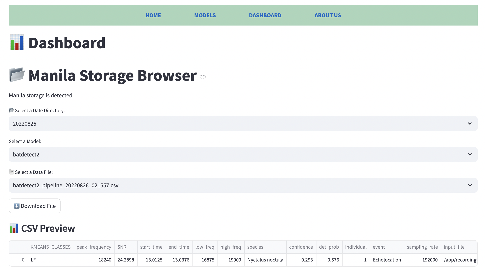

# EcoAcousticAI

## Project Description
The EcoAcousticAI pipeline is designed to:

- Automate the detection and classification of species from ecoacoustic data.

- Store and organize results in Manila storage on Jetstream2.

- Provide an interactive Streamlit dashboard for data exploration, visualization, and download.

## Background

The Union Bay Natural Area (UBNA) is an ecologically significant urban wildlife habitat in Seattle that has a rich and complex soundscape comprising sounds from birds, bats, and other species, as well as anthropogenic sounds from highways, waterways, traffic, and recreational activity. Passive acoustic monitoring (PAM) allows researchers to track biodiversity in such environments, providing insights into animal behaviors and ecological shifts. The EcoAcoustic AI project leverages PAM data collected since 2021, including ~ 68.25 TB of high-resolution audio, to develop an automated, scalable detection pipeline. This initiative builds on previous research efforts to enhance the capability for continuous, efficient monitoring, supporting data-driven soundscape research and community science in urban ecological areas.

## Integrated Models

- **[BirdNET-Analyzer](https://github.com/kahst/BirdNET-Analyzer):** Uses ResNet to identify 6,000+ species including birds, frogs, bugs, and more.

- **[Batty-BirdNET-Analyzer](https://github.com/rdz-oss/BattyBirdNET-Analyzer):** Utilizes transfer learning via BirdNET, resampling input audio to 256 kHz to classify bat echolocation calls.

- **[BatDetect2](https://github.com/macaodha/batdetect2):** Applies a deep neural network to detect and classify bat echolocation calls.

- **[Buzzfindr](https://github.com/joelwjameson/buzzfindr):** Identifies rapid sequences in bat echolocation indicative of feeding behavior.

- **[Custom FrogNET](https://github.com/uw-echospace/EcoAcousticAI/tree/main/birdnetlib/frognet_model):** Adapts BirdNET-Analyzer to detect and classify frog vocalizations.

See Acknowledgments section for adapted repository links

## Repository Structure

```
EcoAcousticAI/
│
├── .github/
│   └── workflows/
│       ├── parallel_wf.yml
│       ├── move_manila_files.yml
│       ├── sync_battybirdnet.yml      
│
├── assets/                     # Static images, logos, or visual elements
│
│
├── bat-detect-msds/            # Bat-detect model files
│
├── birdnetlib/                 # BirdNET library for species detection
│
├── BattyBirdNET-Analyzer/      # Adapted BirdNET model specific for bat calls
│
├── buzzfindr/                  # BuzzFindr files for feeding behavior detection
│
├── docker_runs/                # Bash scripts to run docker containers for each model
│
├── osn_bucket_metadata/        # Metadata for OSN bucket contents
│
├── .gitignore
├── .gitmodules
├── LICENSE
├── README.md
│
├── app.py                     # Streamlit app files for visualizations
│
├── move_manila_files.py        # Script for organizing manila file structure
├── new_data1.py                # Script to detect whether new data has been added to OSN Bucket
│
├── requirements.txt
│
```

## Pipeline Workflow

1. Trigger pipeline by activating Jetstream instance
    - Can be scheduled trigger or manually activated instance  
    - Utilizes Openstack CLI for authentication to Jetstream2

2. Link OSN data bucket to GitHub workflow
    - OSN Bucket is linked to Github repository 
    - Run `new_data1.py` script to check for new data in OSN bucket (implementation detailed in the script)

3. Run model inference in Docker containers across the integrated models  
    - Docker containers provide separate environments for each model

4. Mount model output directory to Manila storage on the Jetstream instance 
    - Uses SSH key to securely connect to Jetstream2
    - Storage name is /ecoacoustic-storage

5. Streamlit instance (with mounted Manila) runs app
    - Dashboard displays output files from the models as well as cumulative activity plots
    - One stop shop for summaries of model results


## Github Actions

```
.github/
│   └── workflows/
│       ├── parallel_wf.yml
│       ├── move_manila_files.yml
│       ├── sync_battybirdnet.yml


```

Within ```.github/workflows/```  are 3 Github actions that automate our pipeline

More information can be found in [Workflows Documentation](.github/workflows/README.md)


## Setup Streamlit App

### Steps to Run `app.py` from GitHub Repo

### 1. Activate Streamlit Instance
Activate your Streamlit instance (it might still appear as "Jacob-instance") on Jetstream2.

### 2. Connect to the Instance
In terminal, run:

```bash
ssh ubuntu@149.165.174.37
```
Additionally, you can login via the [exosphere gui application](https://jetstream2.exosphere.app/)

```bash
ssh exouser@149.165.174.37
```
*The passphrase can be copied directly from the exophere user interface.*

### 3. Activate Virtual Environment
Run the following command to activate the virtual environment:

```bash
source /home/ubuntu/streamlit-venv/bin/activate
```

### 4. Navigate to Project Directory
Change to the `EcoAcousticAI` directory:

```bash
cd /home/ubuntu/EcoAcousticAI
```

### 5. Run the Streamlit App
Start the Streamlit app with the following command:

```bash
streamlit run app.py --server.port 8501 --server.address 0.0.0.0
```

### 6. Access the App in Your Browser
Open the following link in your browser:

```
http://149.165.174.37:8501/
```

or while the domain remains registered, the web app will be accessible via:

```
https://ecoacousticai.com
```


---

### **Shelving the Instance**
When ready to shelve the instance, **remember to uncheck** the box that says:

> "Release public IP address from this instance while shelved"

This keeps the same public IP address when unshelving. If this box is not unchecked, you will need to update the IP address in the URL to match the new public IP.


## Dashboard Page of Streamlit App

### File Browser

- Includes output file dropdown by date
    - Subdirectory model folders
        - Individual result files
- Displays downloadable selected file




### Cumulative Activity Heatmap

- Inspired by code from Aditya Krishna
- Provides summary information including aggregated activity tables and activity heatmaps for all files in a given directory folder (entire day)
- Runs activity plots based on species classified for: birdnet-analyzer, frognet, battybirdnet, batdetect2
- Runs activity plot based on feeding buzz event detected for: buzzfindr

### Cumulative Activity PNG Viewer

- Created using code from Aditya Krishna
- Plots BatDetect2 activity results for an entire year
- Each plot is relevant for a specific location within UBNA

## Future Work

Further developments include enhancing model adaptability, pipeline scalability, and geolocation of calls by microphone. We are working on adapting the Batty-BirdNET-Analyzer model to output species identification formats comparable to BatDetect2. Other visual display options could include higher complexity dashboards such as Bokeh or Tableau.

## Acknowledgments

We extend a special thank you to our sponsors, Wu-Jung Lee and Aditya Krishna, for their invaluable mentorship. 
- [1] Kahl, S., et al. BirdNET-Analyzer. GitHub. https://github.com/kahst/BirdNET-Analyzer.
- [2] Zinke, R., et al. Batty-BirdNET-Analyzer. GitHub. https://github.com/rdz-oss/BattyBirdNET-Analyzer.
- [3] Mac Aodha, O., et al. BatDetect2. GitHub. https://github.com/macaodha/batdetect2.
- [4] Jameson, J. (n.d.). Buzzfindr. GitHub. https://github.com/joelwjameson/buzzfindr 
- [5] Code Author: Aditya Krishna, UW Echospace


