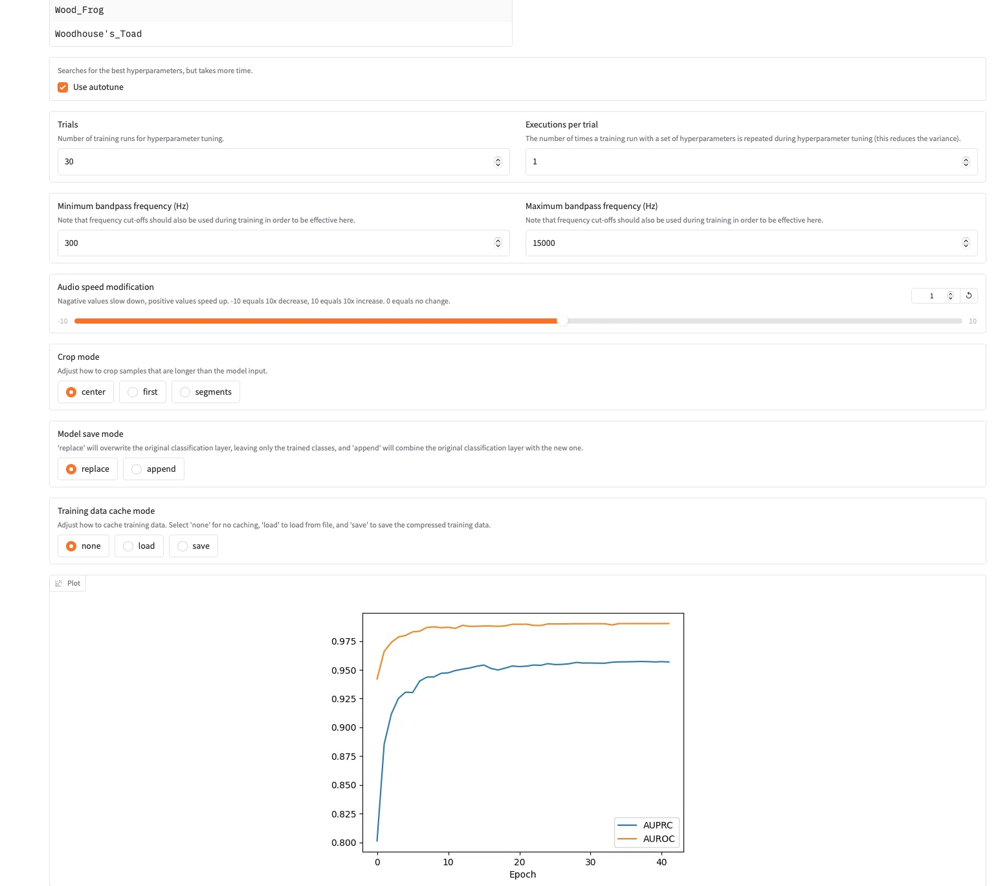

# BirdNET-Analyzer and Custom FrogNET model

- This folder contains scripts to run the [BirdNET-Analyzer model](https://github.com/birdnet-team/BirdNET-Analyzer.git) and a re-trained FrogNET model. FrogNET utilizes the BirdNET framework to create a custom neural network model designed to classify different species of Washington frogs based on audio inputs. In order to run these scripts you don't need to clone the BirdNET-Analyzer repository. Rather they have made a python library called birdnetlib. These scripts utilize this method to analyze preditions for birds, frogs, rodents, and more in King County. 


- *Below documents the data collection, preprocessing, and retraining of the [BirdNET-Analyzer model](https://github.com/birdnet-team/BirdNET-Analyzer.git) to create FrogNET*.

## Table of Contents

- [Installation](#installation)
- [Usage](#usage)
- [License](#license)


## Data Collection

Data can be collected from the following sources for frogs:
1. [iNaturalist](https://www.inaturalist.org/):
  a. Create a free account
  b. Search species by scientific name and select 'view observations'
  c. Filter results by 'has sound', 'reasearch grade', and 'verifiable'
      i. Note: not all frogs have vocal cords, so be sure to double check if your's does!
  d. Export results and run 'download_frog_calls.py' script to download all urls
      i. option to filter further for large result: num_identification_agreements = 2 or 3
  e. Run 'prepare_audio.py' for non .wav files, also to resample to 48000 Hz for training via
     birdnet
3. [Amphibia Web]():
  a. For use when iNaturalist doesn't have enough samples
4. [Califonia Herps](https://californiaherps.com):
  a. For use when iNaturalist and Amphibia Web don't have enough samples 
   

## Installation

To train your own BirdNET model, follow these steps:

1. **Clone the Birdnet-Analyzer repository**:

    ```bash
    git clone https://github.com/birdnet-team/BirdNET-Analyzer.git
    ```


2. **Install the required dependencies**:

   a. Create an environment for birdnet-analyzer:
   ```bash
    python3.11 -m venv [env-namme]
    ```
   b. Install tensorflow first:
   ```bash
    pip3 install tensorflow == 2.15.0
    ```
   c. Install dependencies file:
    ```bash
    pip3 install -e
    ```
   d. Install remaining dependencies for gui:
   ```bash
    pip3 install gradio pywebview matplotlib plotly keras_tuner
    ```

    *Ensure you have Python 3.11 installed.*

## Usage

1. **Run the gui module**:

    ```python
    python3.11 -m birdnet_analyzer.gui
    ```

2. **Navigate to the train tab**

3. **Load your prepard 3-second audio files**

4. **Set desired parameters like**:

   
   
6.  **Run Predictions using your custom model using the multi-file tab**


____ 
Instructions to run 

For more detailed examples and advanced configurations working with birdnet-analyzer, refer to the [github repository]() or the [documentation](link_to_documentation).


## License

This project is licensed under the [MIT License](LICENSE).
