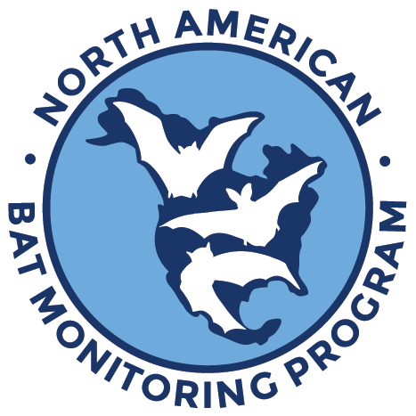

# North American Bat Monitoring Program: NABat Acoustic ML 

## Authors
Benjamin Gotthold, Ali Khalighifar, Joseph Chabarek, Bethany R. Straw, Brian E. Reichert

## Abstract

Bats play crucial ecological roles, and provide valuable ecosystem services, yet many populations face serious threats from various ecological disturbances. The North American Bat Monitoring Program (NABat) aims to assess status and trends of bat populations, while developing innovative and community-driven conservation solutions using its unique data and technology infrastructure. To support scalability and transparency in the NABat acoustic data pipeline, we developed a fully-automated, machine-learning algorithm. This codebase was used to develop V1.0 of our automated machine-learning system for detecting and classifying bat calls in ultrasonic recordings.  This system performs the following major functions:

1) Processing raw audio recording files, extracting bat pulses, and creating spectrogram images of detected pulses.
2) Iteratively training a deep-learning artificial network to create an algorithm that classifies bat pulses to species.
3) Validating and evaluating the classification algorithm's classification performance on holdback data.
4) A trained model for acoustic classification.

## Requirements

The code in this repository was originally written to run in the cloud on Amazon Sagemaker. For convenience, a requirements.txt configuration file is included in the repository.

To create a new local conda environment, the following commands may be helpful:
 
 conda create -n \<env\> python=3.11 
 conda activate \<env\> 
 conda install -c anaconda numpy 
 conda install -c anaconda pandas 
 conda install -c anaconda pytables 
 conda install -c conda-forge matplotlib 
 conda install -c anaconda seaborn 
 conda install -c anaconda scikit-learn 
 conda install -c anaconda scikit-image 
 conda install -c anaconda graphviz 
 conda install -c conda-forge librosa 
 
 pip install tensorflow 
 pip install tensorflow-addons 
 pip install keras-tuner 
 pip install pydot 

## Example Usage
cd \<project root\> 
mkdir classify 
python nabat_ml_cli.py -p ./classify -f ./examples/LABO-1949440.wav

## ORCIDs and Contact Information

Benjamin Gotthold (https://orcid.org/0000-0003-4234-5042)

Ali Khalighifar (https://orcid.org/0000-0002-2949-8143)

Joseph Chabarek (https://orcid.org/0009-0004-2761-3082)

Bethany R. Straw (https://orcid.org/0000-0001-9086-4600)

Brian E. Reichert (https://orcid.org/0000-0002-9640-0695)

If you have questions about the software, please contact Brian Reichert (breichert@usgs.gov).

## License

This project is licensed under the Creative Commons Attribution 4.0 International Public License.

## Suggested Citation for Software

Gotthold, B.S., Khalighifar, A., Chabarek, J., Straw, B.R., Reichert, B.E., 2024, North American Bat Monitoring Program: NABat Acoustic ML, (version 2.0.0): U.S. Geological Survey software release, https://doi.org/10.5066/P1QBMNSF.

## Larger Citation

Gotthold, B., Khalighifar, A., Straw, B.R., and Reichert, B.E., 2022, Training dataset for NABat Machine Learning V1.0: U.S. Geological Survey data release, https://doi.org/10.5066/P969TX8F.

## IPDS

IP-137366, IP-136565, IP-160095
